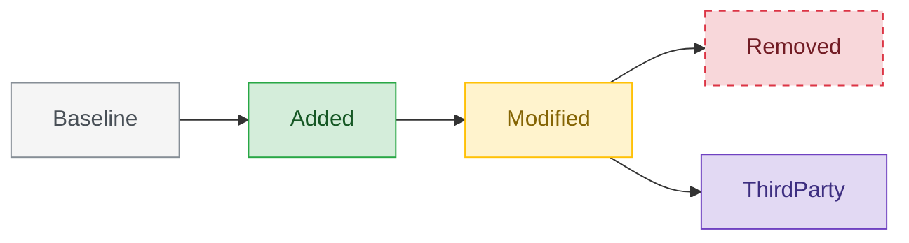

# Color Palette for Software Diagrams

Colors in software diagrams are a **signal**, not decoration. Use them to encode meaning a reader cannot get from structure alone. Every color must pair with a legend.

## The default semantic palette

Pastel, high-lightness, colorblind-friendly when paired with a second channel (text or stroke pattern).

| Semantic | Fill (hex) | Stroke (hex) | Text (hex) | Pairs well with |
|---|---|---|---|---|
| Added / New | `#D4EDDA` | `#28A745` | `#155724` | solid stroke |
| Removed / Deprecated | `#F8D7DA` | `#DC3545` | `#721C24` | **dashed** stroke (accessibility) |
| Modified / Changed | `#FFF3CD` | `#FFC107` | `#856404` | solid stroke + "Δ" marker |
| Unchanged / Baseline | `#F5F5F5` | `#868E96` | `#495057` | solid stroke |
| External / 3rd-party | `#E2D9F3` | `#6F42C1` | `#3D2E80` | solid stroke |
| Hot path / Critical | `#FDE2E4` | `#E63946` | `#6A1B1A` | thick stroke (2px) |
| Async / Event | `#D1ECF1` | `#17A2B8` | `#0C5460` | dashed arrow |
| Deprecated but in use | `#FFE5B4` | `#FD7E14` | `#7F3C0B` | dashed stroke + label "(deprecated)" |

When you're using a second palette *on top of* the change palette (e.g., the architecture has team-ownership coloring AND you need to show changes), prefer coloring **borders** for one dimension and **fills** for the other. Two fills fight.

## Secondary palette (for ownership / layering / classification)

When the diagram is not about change but about *who owns what* or *what layer it lives in*:

| Team / Layer | Fill | Stroke |
|---|---|---|
| Frontend / Edge | `#E3F2FD` | `#1976D2` |
| Application / Business | `#FFF3E0` | `#F57C00` |
| Data / Persistence | `#E8F5E9` | `#388E3C` |
| Platform / Infra | `#ECEFF1` | `#455A64` |
| Security / Compliance | `#FCE4EC` | `#C2185B` |
| AI / ML | `#F3E5F5` | `#7B1FA2` |

Do not invent ad-hoc colors. If the user's team has a brand palette, ask — otherwise use these.

## Accessibility rules

1. **Never encode meaning in color alone.** Also use: stroke style (solid/dashed), a text suffix (`[new]`, `(deprecated)`), or a unicode marker (➕, ⚠, ⊘).
2. **Contrast**: stroke color should be darker than fill; text color should pass WCAG AA against fill (>4.5:1 for small text). The palette above satisfies this.
3. **Grayscale survival**: print the diagram in grayscale in your head. If you can still tell Added from Removed, you're good. The dashed stroke for Removed is what gives you that.
4. **No more than 5 semantic colors** in a single diagram — past that, the reader stops reading colors as signals.

## Applying the palette

### Mermaid


### PlantUML
```plantuml
skinparam class {
    BackgroundColor<<Added>>     #D4EDDA
    BorderColor<<Added>>         #28A745
    BackgroundColor<<Removed>>   #F8D7DA
    BorderColor<<Removed>>       #DC3545
    BackgroundColor<<Modified>>  #FFF3CD
    BorderColor<<Modified>>      #FFC107
    BackgroundColor<<Baseline>>  #F5F5F5
    BorderColor<<Baseline>>      #868E96
    BackgroundColor<<External>>  #E2D9F3
    BorderColor<<External>>      #6F42C1
}

' inline form for ad-hoc:
class Foo #D4EDDA
```

## Legend templates

### Mermaid — Legend as subgraph
```
subgraph Legend["图例 / Legend"]
    direction LR
    L1[Unchanged / 未变]:::baseline
    L2[Added / 新增]:::added
    L3[Modified / 修改]:::modified
    L4[Removed / 移除]:::removed
end
```

### PlantUML — Legend block
```
legend right
    | <#D4EDDA> | Added / 新增 |
    | <#F8D7DA> | Removed / 移除 |
    | <#FFF3CD> | Modified / 修改 |
    | <#F5F5F5> | Unchanged / 未变 |
    | <#E2D9F3> | External / 外部 |
endlegend
```

If the diagram is itself small (<5 colored nodes), the legend can grow larger than the diagram — in that case, inline-annotate each colored node (`NewSvc [NEW]`) and skip the legend block.

## See also

- **`references/change-visualization.md`** — when the diagram's primary job is to show *what changed* (added / modified / removed / renamed across files; v1→v2; commit/PR/migration summaries), this file extends the palette above with: a **Renamed** state, **two-dimensional fill+stroke coloring** (state × file category), an **emoji-prefix** convention for dense overviews, **two-row legend** templates, and class/sequence/architecture-specific change conventions. Read it whenever the user asks to "highlight what changed", "visualize a commit", or "compare v1 vs v2".
