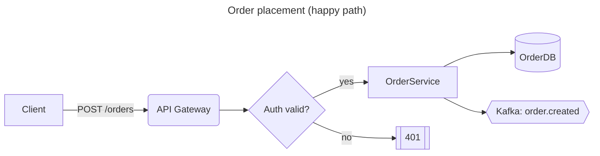
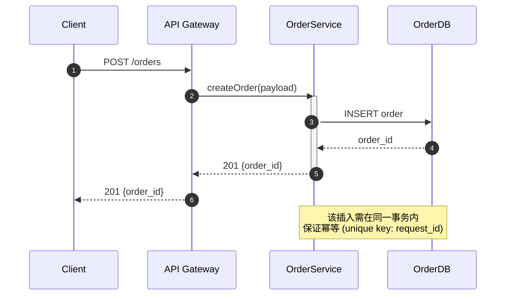
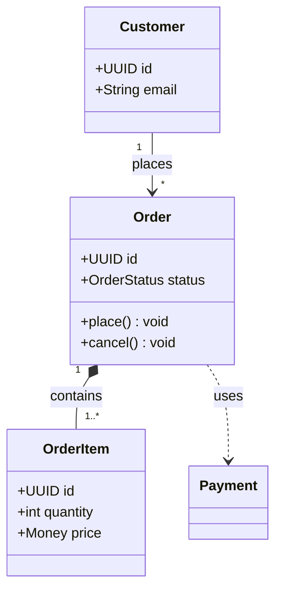
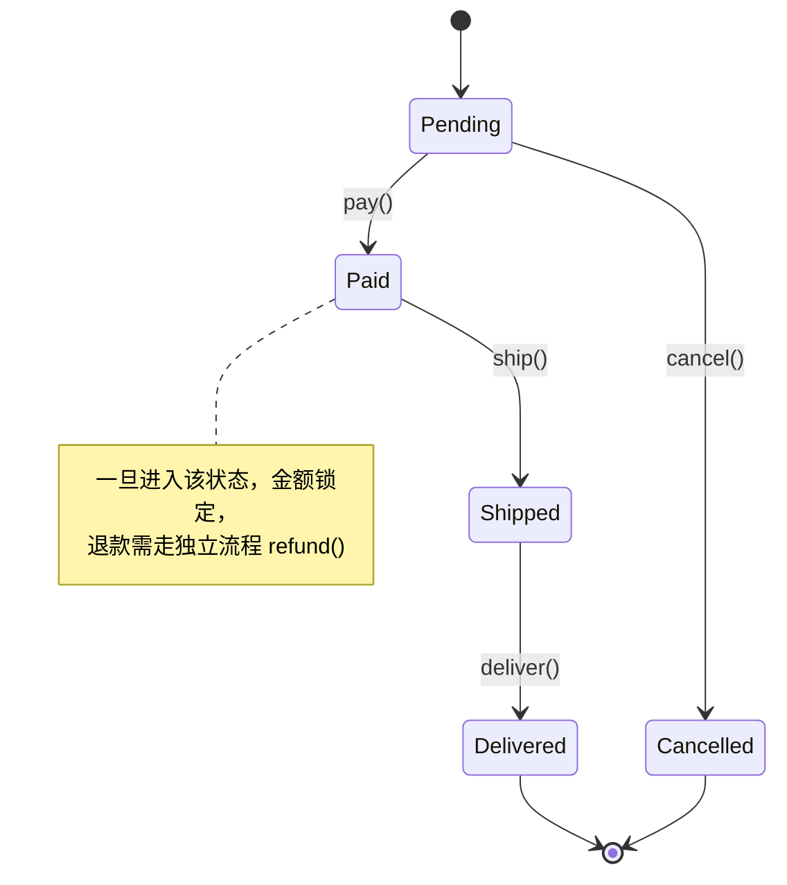
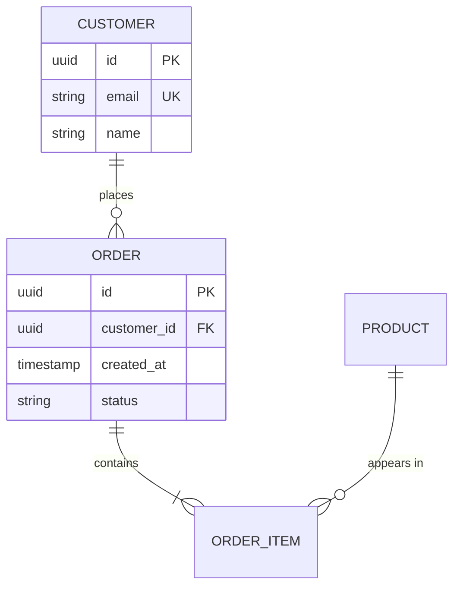
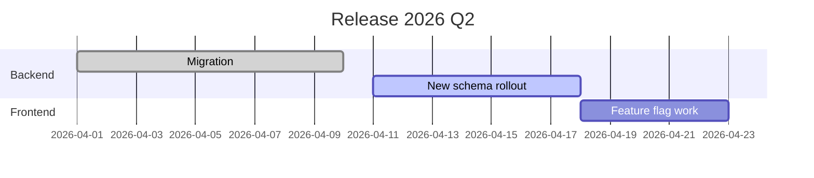
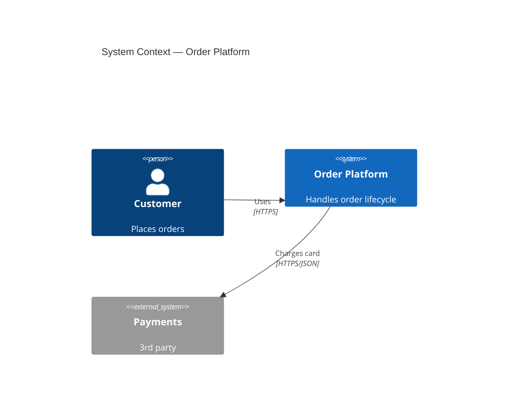
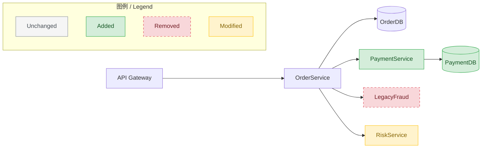

# Mermaid Guide

Reference for producing Mermaid diagrams that render cleanly in GitHub, GitLab, Notion, Obsidian, and `mmdc`.

## Table of contents
- [Picking a diagram type](#picking-a-diagram-type)
- [Flowchart](#flowchart)
- [Sequence diagram](#sequence-diagram)
- [Class diagram](#class-diagram)
- [State diagram](#state-diagram)
- [ER diagram](#er-diagram)
- [Gantt](#gantt)
- [C4 (architecture)](#c4-architecture)
- [Background color patterns](#background-color-patterns)
- [Notes in Mermaid](#notes-in-mermaid)
- [Common pitfalls](#common-pitfalls)

## Picking a diagram type

| You want to show… | Use |
|---|---|
| Control flow, process, pipeline | `flowchart LR` or `flowchart TB` |
| Runtime message passing between actors | `sequenceDiagram` |
| Static type structure, inheritance, composition | `classDiagram` |
| Lifecycle / state machine | `stateDiagram-v2` |
| Data model, tables, relationships | `erDiagram` |
| Schedule, milestones | `gantt` |
| System context / container / component (C4 model) | `C4Context` / `C4Container` |
| Git branch topology | `gitGraph` |
| User journey | `journey` |
| Mind map | `mindmap` |

When in doubt, `flowchart` is the most forgiving and widely supported.

## Flowchart



Shape vocabulary (pick semantically, not randomly):
- `[ ]` rectangle — generic node / service
- `( )` rounded — soft action / step
- `([ ])` stadium — start / end
- `{ }` diamond — decision
- `[[ ]]` subroutine — encapsulated behavior (error/return)
- `[( )]` cylinder — database / persistent store
- `{{ }}` hexagon — message / event
- `>[text]` asymmetric — input
- `((text))` circle — connector / join

Directions: `TB` / `TD` (top-down), `BT`, `LR`, `RL`.

Subgraphs group related nodes:
```
subgraph Backend
    D[OrderService]
    F[(OrderDB)]
end
```

## Sequence diagram



Arrow types: `->` line, `-->` dashed line, `->>` arrow, `-->>` dashed arrow, `-x` arrow with cross (lost), `--)` open arrow (async).

Use `autonumber` for diagrams longer than ~5 steps; it makes review comments ("step 4 is wrong") meaningful.

Parallelism / alternatives:
```
par branch A
    S->>X: ...
and branch B
    S->>Y: ...
end

alt success
    S-->>C: 200
else failure
    S-->>C: 500
end

opt when feature_flag_on
    S->>Z: ...
end

loop every 1s
    S->>H: heartbeat
end
```

## Class diagram



Relationships:
- `--|>` inheritance (extends)
- `..|>` realization (implements)
- `--*` composition (owned)
- `--o` aggregation (shared)
- `-->` association
- `..>` dependency
- `--` link (non-directional)

Member visibility: `+` public, `-` private, `#` protected, `~` package.

## State diagram



Composite states, parallel regions, and history are supported — see mermaid.js docs if needed.

## ER diagram



Cardinality cheatsheet: `||--||` exactly-one to exactly-one; `||--o{` one-to-many; `}o--o{` many-to-many optional.

## Gantt



## C4 (architecture)



Useful when the audience is non-engineering — C4 enforces the right level of abstraction.

## Background color patterns

Mermaid supports node styling via `style` and class definitions. For diagrams that encode *change*, use `classDef`:



Rules:
- Always set `fill`, `stroke`, and `color` together (contrast safety).
- Use dashed stroke for "removed/deprecated" so the signal survives grayscale printing.
- Always include a Legend subgraph when using classDef semantically.

For subgraph-level tinting (whole regions):
```
style Backend fill:#E8F5E9,stroke:#2E7D32
```

## Notes in Mermaid

Mermaid's note story varies by diagram type:
- **Sequence**: `Note over A,B: text` / `Note left of A: text` / `Note right of A: text`. Multi-line via `<br/>`.
- **State**: `note right of StateName\n  text\nend note`.
- **Flowchart**: no native note. Use a styled node:
  ```
  N1["📝 说明：该路径只在 v2 启用"]:::note
  classDef note fill:#FFFDE7,stroke:#FBC02D,color:#5D4037
  N1 -.-> SomeNode
  ```
  Dashed link (`-.->`) signals the annotation is not part of the flow.
- **Class**: use `<<stereotype>>` for typing and a side node attached via dependency for longer commentary.

CJK / Chinese works in all of the above in standard renderers. If embedding in a renderer known to have font issues, fall back to PlantUML.

## Common pitfalls

- **Reserved characters in labels** — parentheses, pipes, quotes inside labels need to be wrapped in `"..."`: `A["foo (bar)"]`.
- **Spaces in node IDs** — node IDs must not contain spaces. `Order Service` ❌; `OrderService` ✅; or use a short ID and a label: `OS[Order Service]`.
- **`end` is reserved** — do not name a node `end`. Use `End` or `finish`.
- **Long edge labels wrap poorly** — keep under ~20 chars; put the rest in a `Note`.
- **Subgraph titles with spaces** — must be quoted: `subgraph "My Service"`.
- **Directive placement** — `---\ntitle: ...\n---` must be the very first lines, before the diagram type declaration.
- **`classDef` must be defined before it is used** in some renderers; define all classDefs at the end for safety (most renderers allow either, but "end" is most portable for GitHub).
- **`<br>` vs `<br/>`** — use `<br/>` (self-closing); bare `<br>` breaks in strict XHTML renderers.
- **Comments**: `%% this is a comment` on its own line. Do not inline after code on the same line.
