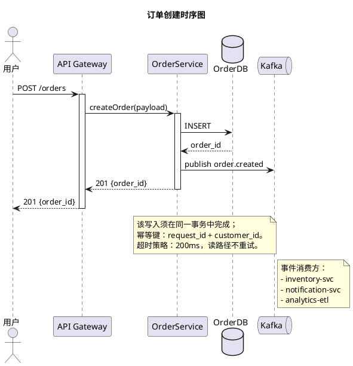
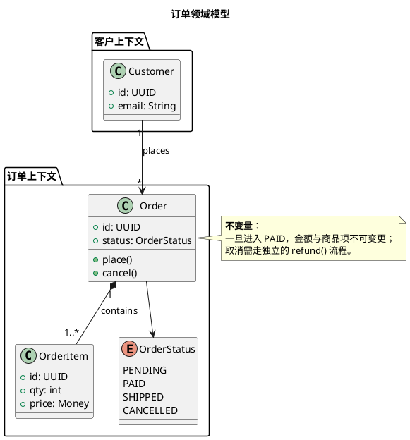
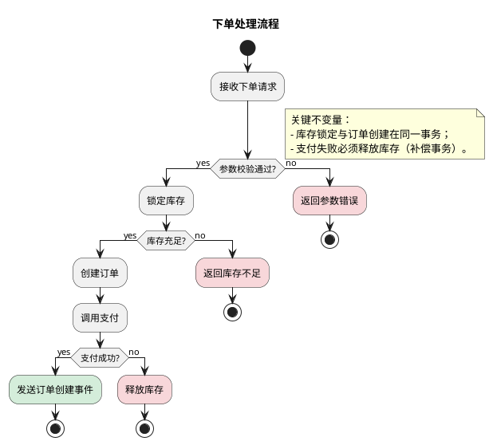
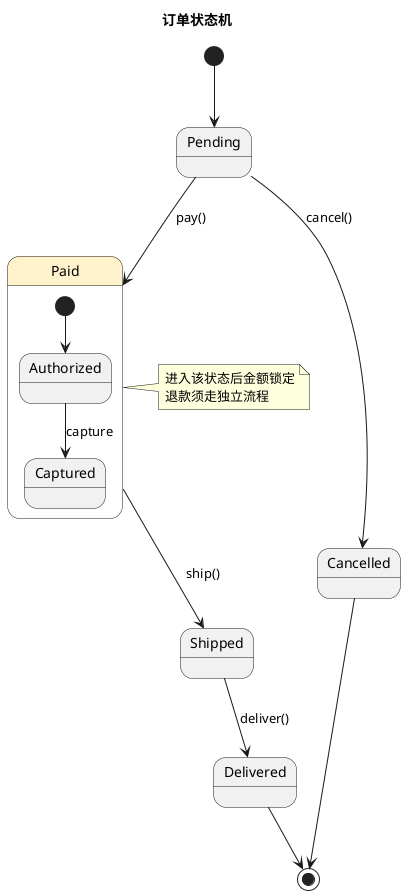
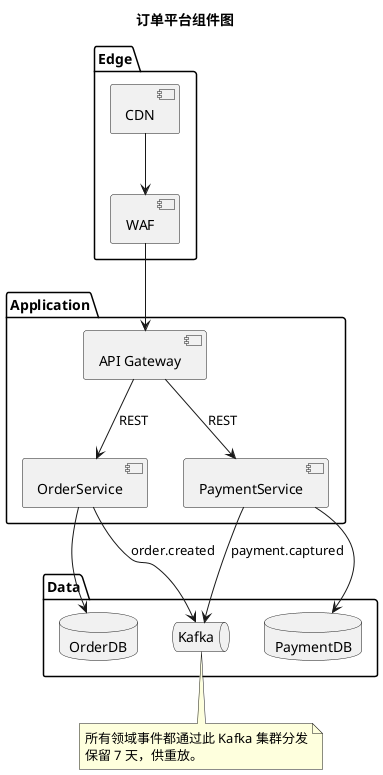
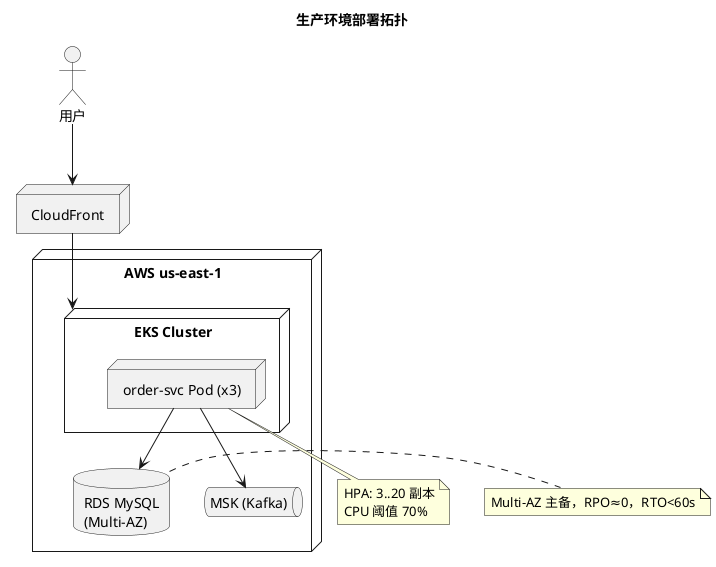
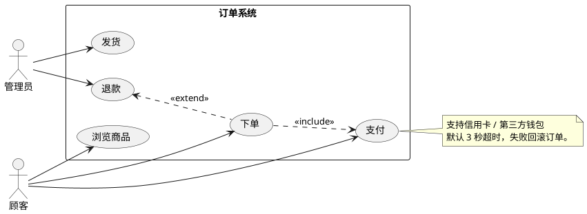
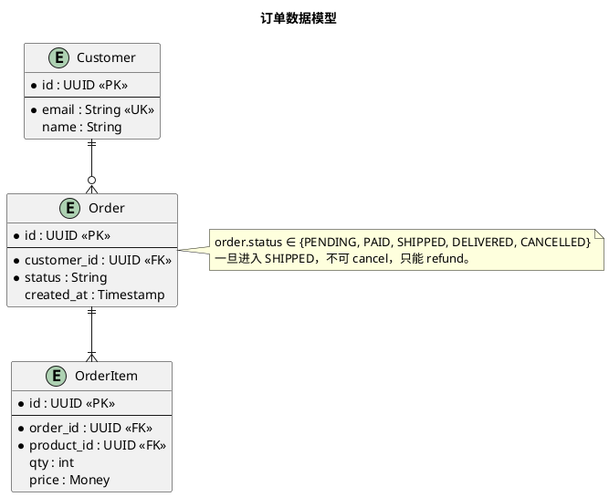
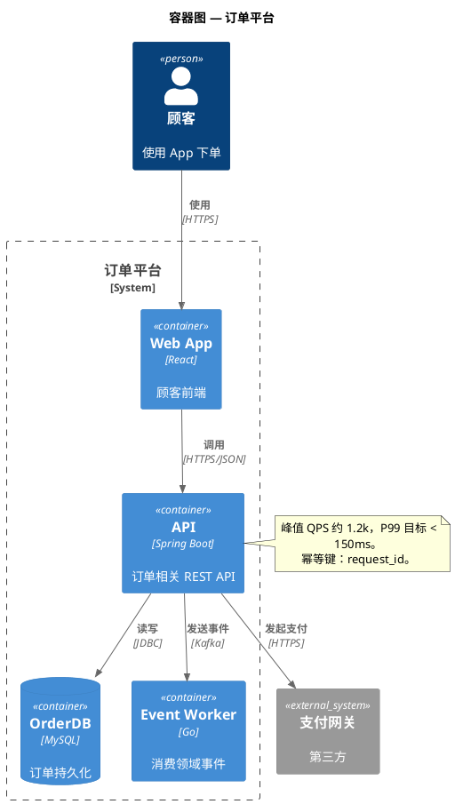

# PlantUML Guide

Reference for producing PlantUML diagrams that render cleanly via the official `plantuml` jar or the `plantuml.com` server.

## Table of contents
- [Required header for Chinese text](#required-header-for-chinese-text)
- [Picking a diagram type](#picking-a-diagram-type)
- [Sequence diagram](#sequence-diagram)
- [Class diagram](#class-diagram)
- [Activity / flowchart](#activity--flowchart)
- [State diagram](#state-diagram)
- [Component diagram](#component-diagram)
- [Deployment diagram](#deployment-diagram)
- [Use-case diagram](#use-case-diagram)
- [ER diagram (Information Engineering)](#er-diagram-information-engineering)
- [C4 model (via stdlib)](#c4-model-via-stdlib)
- [Notes — the mandatory piece](#notes--the-mandatory-piece)
- [Background colors](#background-colors)
- [Skinparam cheatsheet](#skinparam-cheatsheet)
- [Common pitfalls](#common-pitfalls)

## Required header for Chinese text

Every PlantUML diagram this skill produces should start with the CJK-friendly header so Chinese notes render correctly in the jar/server:

```plantuml
@startuml
' CJK font + rendering defaults
skinparam defaultFontName "Microsoft YaHei"
skinparam defaultFontSize 13
skinparam dpi 120
skinparam backgroundColor #FFFFFF
skinparam shadowing false
skinparam roundCorner 8
skinparam ArrowThickness 1.2
skinparam NoteBackgroundColor #FFF8E1
skinparam NoteBorderColor #FBC02D
' fall back through common CJK fonts — the first one available wins
' ("Microsoft YaHei" on Windows, "PingFang SC" / "Hiragino Sans GB" on macOS,
' "Noto Sans CJK SC" / "WenQuanYi Micro Hei" on Linux)
```

If the render environment is Linux and `Microsoft YaHei` is unavailable, switch `defaultFontName` to `"Noto Sans CJK SC"` or install a CJK font. The PlantUML server at `plantuml.com` has CJK fonts installed.

## Picking a diagram type

| Subject | Use |
|---|---|
| Runtime message passing, async flows | sequence |
| Static type structure, inheritance | class |
| Procedural flow, decision tree | activity (new syntax `start`/`stop`) |
| Lifecycle | state |
| Logical components + interfaces | component |
| Physical topology (nodes, artifacts) | deployment |
| Actors vs system functions | use-case |
| Data model | ER (IE notation) via `entity` |
| Architecture @ system / container / component level | C4 (stdlib) |

## Sequence diagram



Arrow flavors: `->` sync, `-->` response, `->>` async, `-\` lost, `/-` found, `-[#red]->` colored.

Groupings: `group`, `alt/else/end`, `opt/end`, `loop/end`, `par/else/end`, `break/end`, `critical/end`.

## Class diagram



Relation notation: `<|--` inheritance, `<|..` realization, `*--` composition, `o--` aggregation, `-->` association, `..>` dependency, `--` link.

## Activity / flowchart

Use the **new** activity syntax (`start` / `stop` / `if (...) then (yes)` / `endif`). The legacy `(*)` syntax is deprecated — do not produce it.



Swimlanes via `|Lane|`:
```
|用户|
:下单;
|#E3F2FD|订单服务|
:校验;
|#FFF3E0|支付服务|
:扣款;
```

## State diagram



## Component diagram



## Deployment diagram



## Use-case diagram



## ER diagram (Information Engineering)



## C4 model (via stdlib)



## Notes — the mandatory piece

**Every PlantUML diagram this skill produces must carry at least one `note`**. Chinese notes are explicitly supported. Use whichever form fits:

| Form | When |
|---|---|
| `note left of X` / `note right of X` / `note top of X` / `note bottom of X` | Anchored to a specific element |
| `note over A, B` (sequence only) | Spans multiple participants |
| `note as N1` ... `X .. N1` | Floating note connected by a dashed line |
| Multi-line `note ... end note` | Longer context, markdown-lite supported |

Multi-line example:
```
note right of OrderService
    **设计决策**：
    - 选用 outbox pattern 保证事件与订单在同一事务；
    - 不使用 2PC，避免跨服务锁。
    **已知风险**：
    - outbox 积压时事件延迟可能达秒级。
end note
```

Inline styling inside notes: `**bold**`, `//italic//`, lists with `-` or `*`, line breaks with real newlines.

Coloring notes: `note right of X #LightYellow` or via `skinparam NoteBackgroundColor`.

Guideline: one **top-of-diagram summary note** describing scope/intent is a good default when no other note is obviously needed. It keeps the non-negotiable satisfied and actually helps the reader.

## Background colors

Three layers of color control:

**1. Per-element inline color** — the simplest and most common for highlighting:
```
class OrderService #D4EDDA
participant "NewService" as NS #D4EDDA
node "NewNode" #D4EDDA
rectangle "Added Region" #D4EDDA
state Paid #FFF3CD
```

For activity nodes:
```
#D4EDDA:新增步骤;
#F8D7DA:待移除步骤;
#FFF3CD:修改后的步骤;
```

**2. Per-element `<<stereotype>>` + skinparam** — when a semantic group is used many times:
```
skinparam class {
    BackgroundColor<<Added>>    #D4EDDA
    BorderColor<<Added>>        #28A745
    BackgroundColor<<Removed>>  #F8D7DA
    BorderColor<<Removed>>      #DC3545
    BackgroundColor<<Modified>> #FFF3CD
    BorderColor<<Modified>>     #FFC107
}

class PaymentService <<Added>>
class LegacyFraud  <<Removed>>
class RiskService  <<Modified>>
```

**3. Container/package tint** for entire regions:
```
package "新增边界上下文" <<Added>> #D4EDDA {
    class NewEntity
}
```

Legend pattern — always include one when color carries meaning:
```
legend right
    | 颜色 | 含义 |
    | <#D4EDDA> | Added / 新增 |
    | <#F8D7DA> | Removed / 移除 |
    | <#FFF3CD> | Modified / 修改 |
    | <#F5F5F5> | Unchanged / 未变 |
endlegend
```

## Skinparam cheatsheet

```
skinparam defaultFontName "Microsoft YaHei"
skinparam defaultFontSize 13
skinparam dpi 120
skinparam backgroundColor #FFFFFF
skinparam shadowing false
skinparam roundCorner 8
skinparam ArrowColor #424242
skinparam ArrowThickness 1.2
skinparam NoteBackgroundColor #FFF8E1
skinparam NoteBorderColor #FBC02D
skinparam sequence {
    ArrowColor #424242
    ActorBorderColor #424242
    LifeLineBorderColor #888888
    ParticipantBorderColor #424242
    ParticipantBackgroundColor #FAFAFA
}
```

## Common pitfalls

- **Missing `@startuml` / `@enduml`** — the most common rendering failure.
- **Using deprecated activity syntax** `(*) --> "foo"` — use new syntax (`start` / `:...;` / `stop`).
- **Chinese box garbled as `???`** — `skinparam defaultFontName` not set, or font missing on the rendering host. On `plantuml.com`, CJK fonts are installed; on a local jar, install a CJK font and reference it.
- **Quoted vs unquoted identifiers** — names with spaces or Chinese need quotes: `participant "订单服务" as OS`.
- **Arrow direction in class diagrams** — `<|--` vs `--|>` is the opposite of what many people expect. Parent is always on the `<|` side.
- **`as` aliases with Chinese** — quote the label, use a Latin alias: `participant "订单服务" as OS`. Then use `OS` in arrows.
- **Implicit element creation** — sequence/use-case diagrams will silently create a participant on first use. Declare participants up front to control layout.
- **Note on arrow** — to attach a note *to an arrow*, use the inline form `A -> B : call\nnote right: 说明`, or use a floating note with a dashed link.
- **Dueling skinparam** — if you declare skinparam per-subsystem (e.g., `skinparam class` block), later global settings may override them. Put global skinparam at the top.
- **Theme collisions** — `!theme` can override your skinparam. If you use a theme, layer skinparam *after* the `!theme` line.
